<!-- _class: lead -->

# **Update Meeting October 2025**

---

# **Tactile processing pipeline for texture classification/regression.**

**Three main tasks:**

- Data Recording

- Frequency extraction model

- Spiking Neural Network Derivation

---

# **Data Recording**

**Two options:**

- Use software encoding to get FAI and SAII spikes (from Simon).

- Use hardware encoding : Ella's chip (for now) and then new chip to get tactile recordings.

---

# **Software Encoding**

  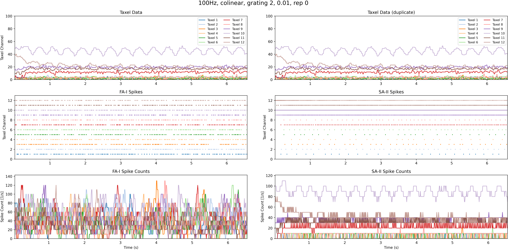

---

# **Hardware Encoding**

Use Omega robot with Robert's piezo sensor + bought capacitive sensor with Ella's chip.

**TODOs:**

- Merge Simon's code with Simeon code. 

- Print 3D support to attach sensors to Omega robot.

- Test setup with different tactile gratings.

---

# **Tactile Gratings**

  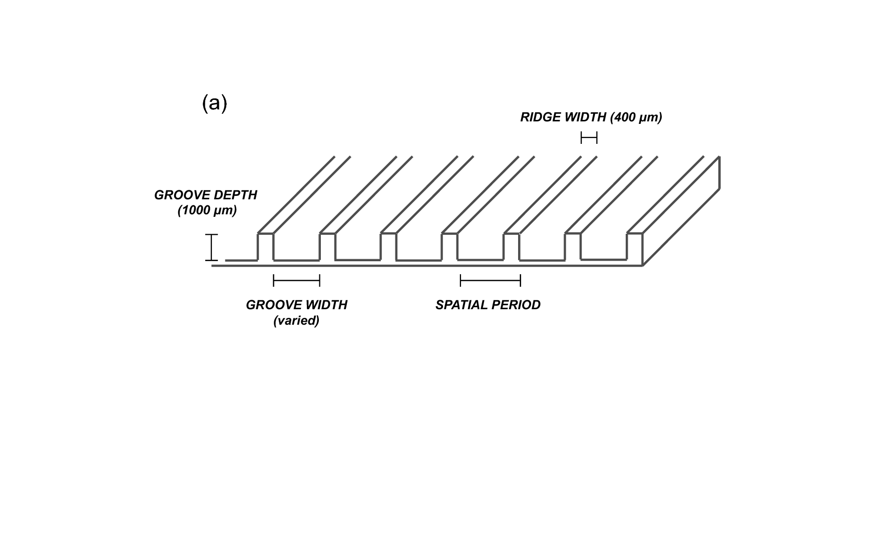

---

# **Piezoelectric Sensors**

  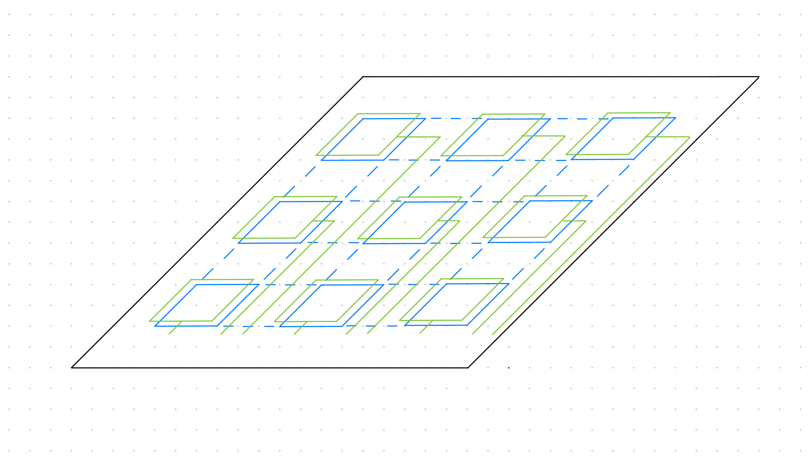

---

# **Frequency Extraction Model**

**Implemented Elisabetta's sPLL in Brian2.**

- sPLL's TDE is silent only if perfect frequency match.

- All other sPLL fires many spikes.

---
# **Time Difference Encoder**

---

# **No-match Frequencies (Input : 30Hz | CCO : 20Hz)**

  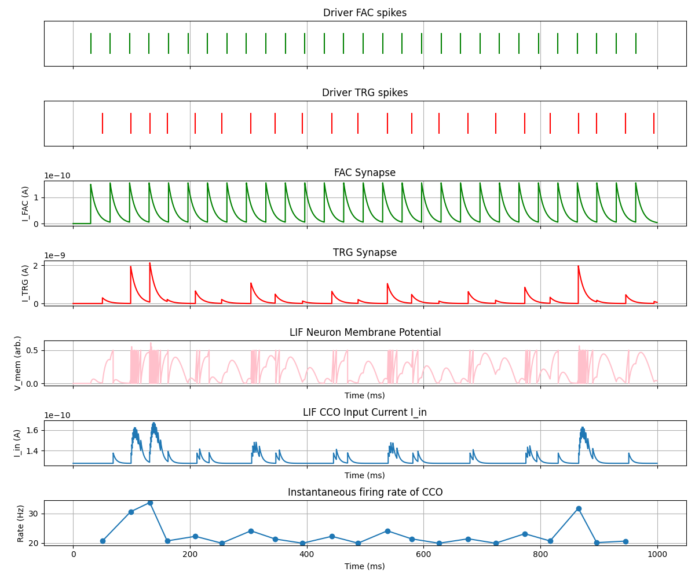

---

# **Matching Frequencies (20 Hz)**

  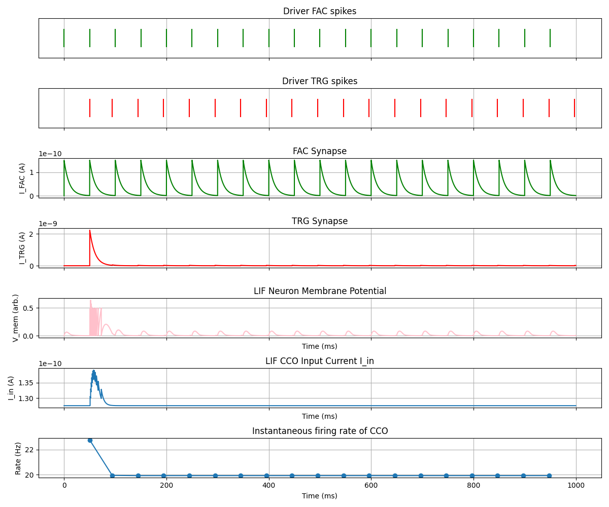

---

# **Matching Frequencies (20 Hz) with noise**

  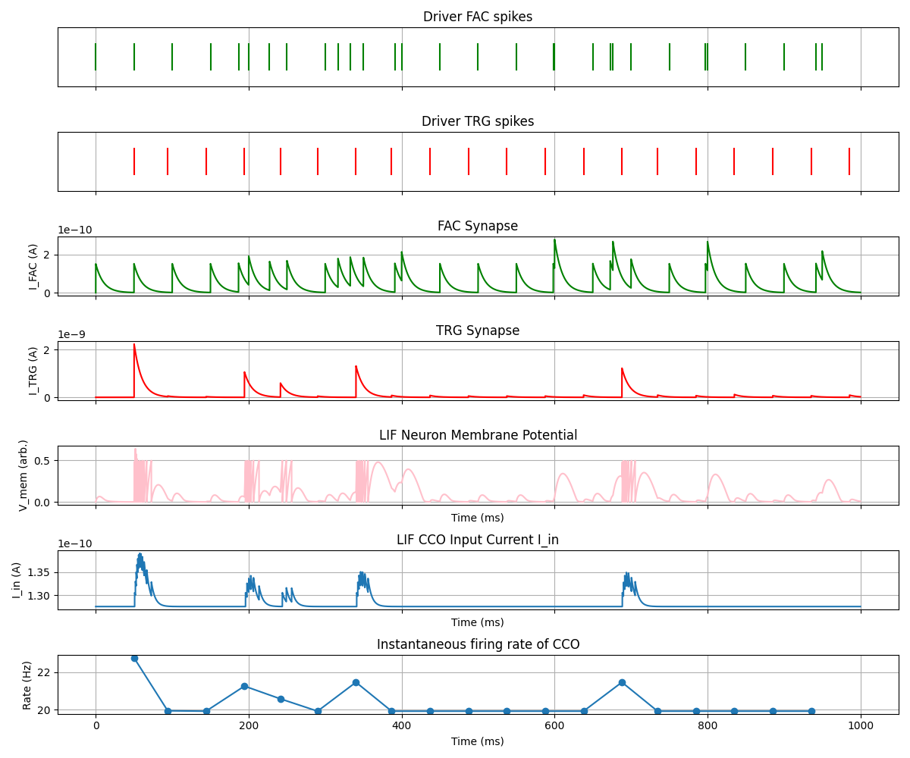

---

# **Improvement for a PLL**

- Decomposition in a selected bandwidth (neuromorphic cochlea).

- Spiking or bursting neuron with tunable bandwidth.

---

# **Processing Pathway**

Inspiration from Predictive Coding:

  

- Unclear how to implement in SNNs.

---

# **Predictive Coding Light**

Concrete implementation in SNNs.

  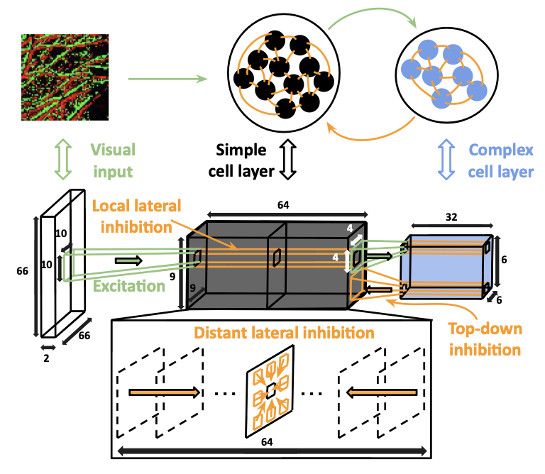

---

# **Advantages of PCL**

- No residual errors propagation.

- Suppresses most predictable spikes.

- Concrete implementation in SNNs.

- Uses inhibitory STDP (online learning).

---

# **Functioning of PCL**

  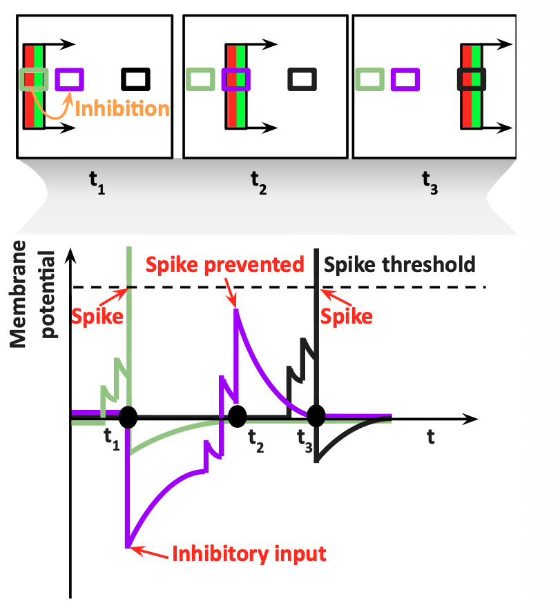

---

# **Steps to implement PCL-like network**

- Simple SNN with STDP learning rule.

- Addition of inhibitory connections.

- Understand receptive fields for texture recognition.

- Derive appropriate network configuration for the task.

---

# **STDP Synapses**

  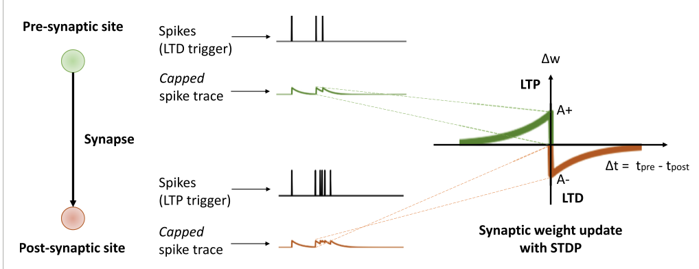

---

# **STDP Synapses**

  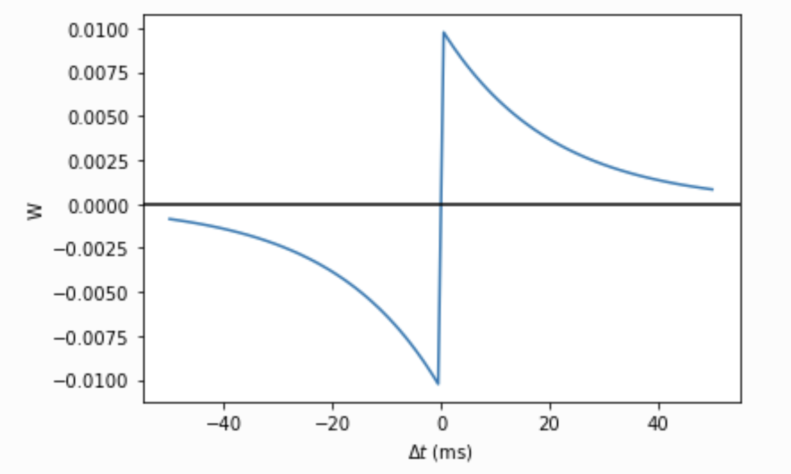

---

# **STDP Synapses Brian2**

  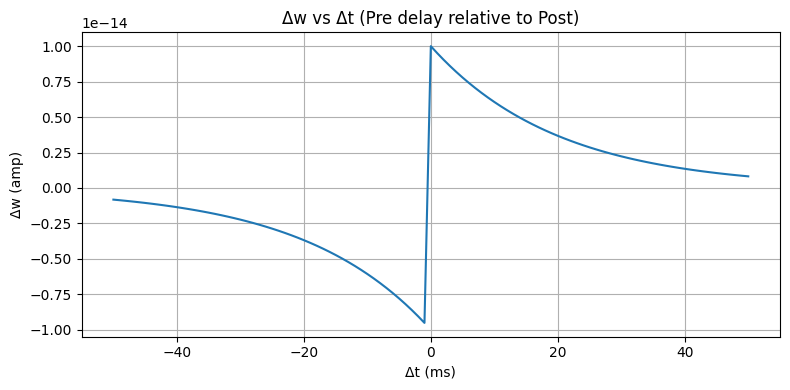

---

# **STDP Synapses with LIF (Pre rate > Post rate)**

  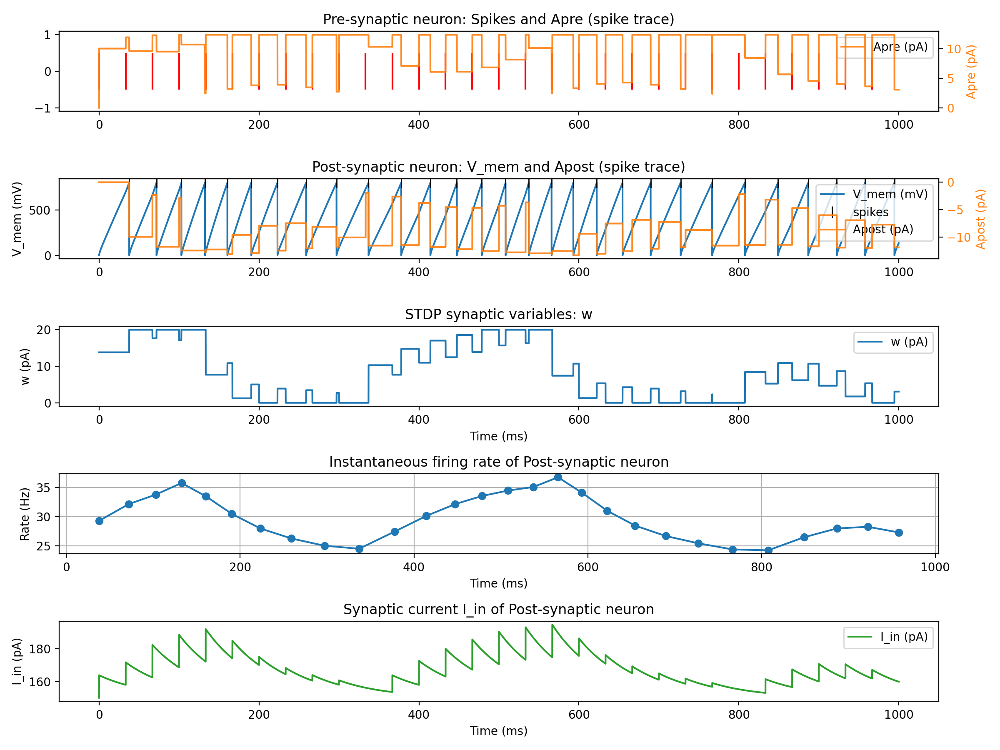

---

# **C-STDP Synapses**

- More biologically plausible.

- Uses a single transient calcium trace.

- $\tau \frac{d\rho}{dt} = -\rho (1 - \rho)(\rho_* - \rho) + \gamma_p(1-\rho)\Theta(c(t)-\theta_p)\\ \\ - \gamma_d\rho\Theta(c(t)-\theta_d) + Noise(t)$

---

# **C-STDP Synapses**

  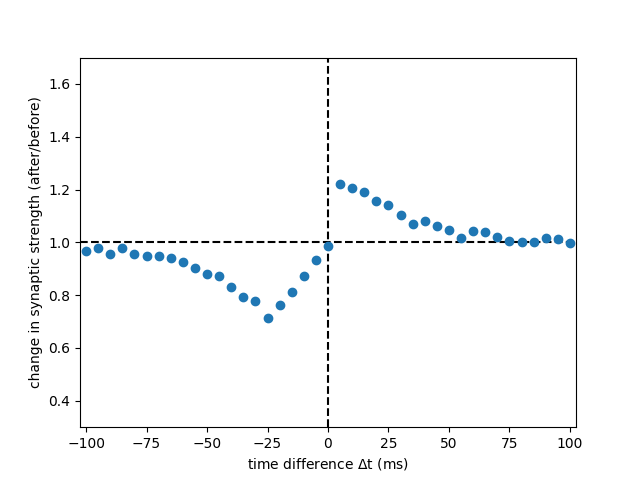

