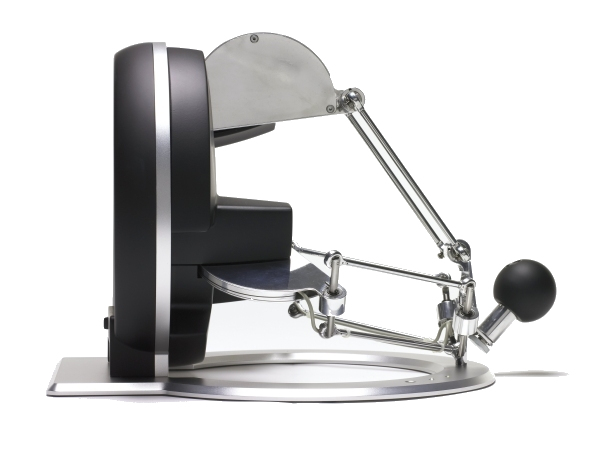

<!-- _class: lead -->

# SNACE Meeting
### 20.11.25 Meeting

---

# Progress this past month

- Started deriving experiment setup to characterize the tactile processing chip:

  

---

# Progress this past month

- Sensor setup (Piezoelectric + Capacitive):

---

<!-- # Progress this past month

- Chip recording:

 -->

# Progress this past month

- Old Chip recording:

|  |  |
|---|---|

---

# Progress this past month

- Started reading about Resonate and Fire neuron (type 3 neuron) for frequency extraction.

- Goal is to have a band-pass filtering neuron with tunable cutoff frequencies.

