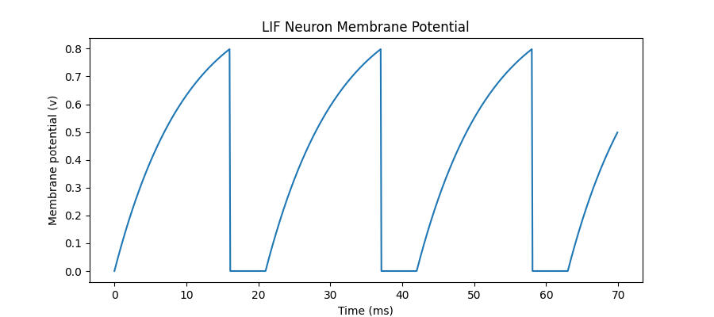
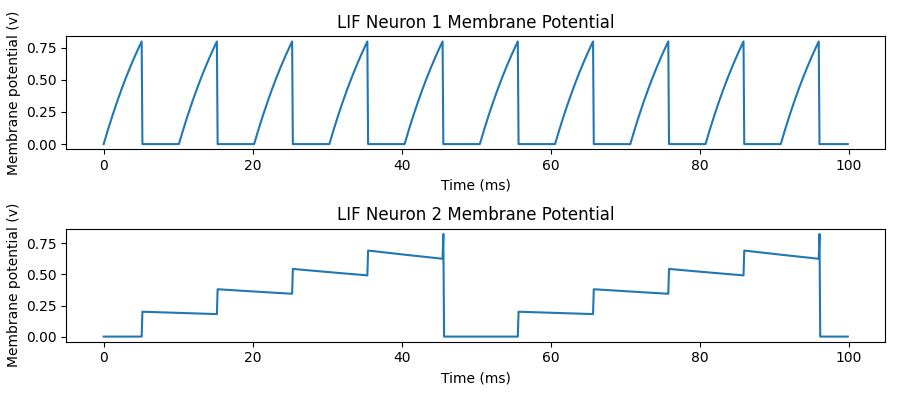
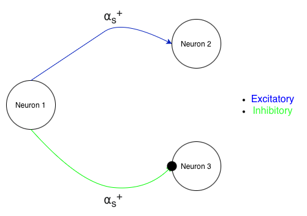
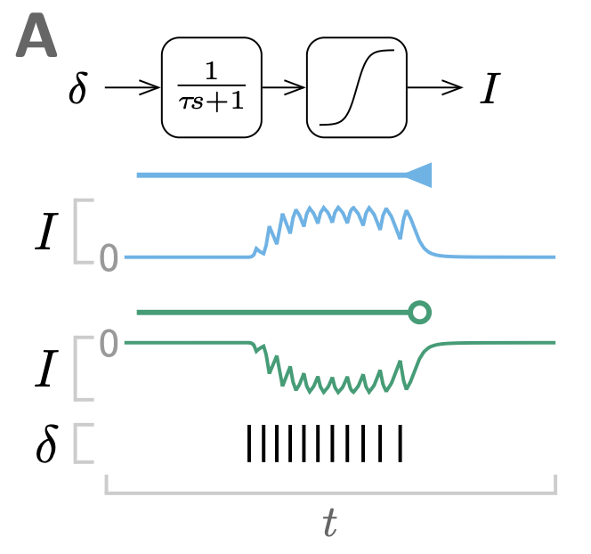
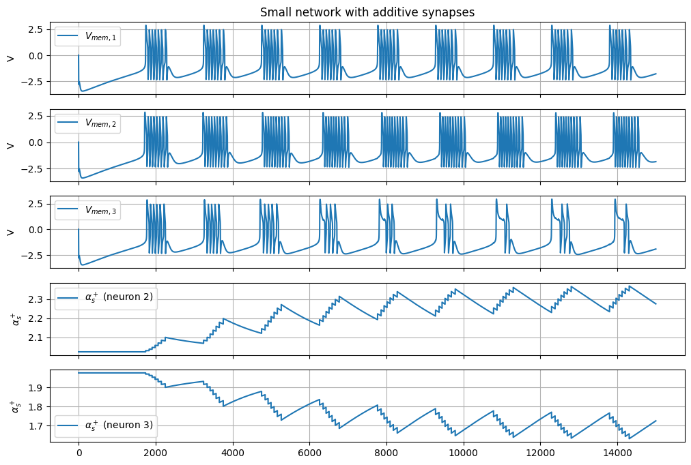
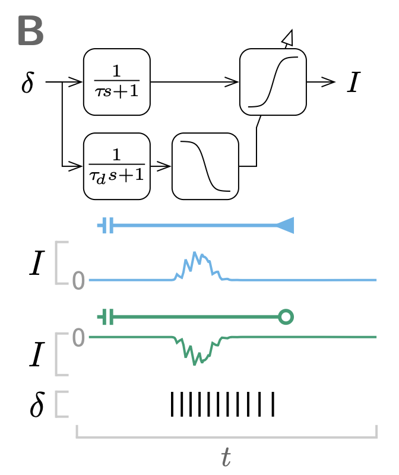
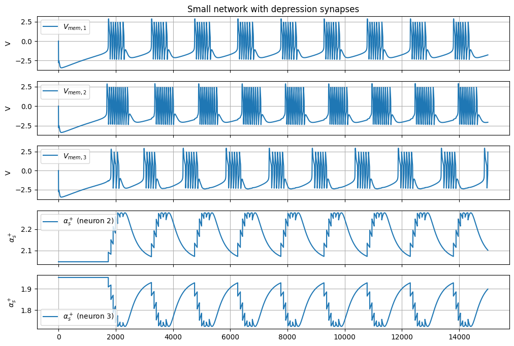

<!-- _class: lead -->

# Brian2 Basics: Neurons & Synapses
### From LIF cells to spike-driven connections


---

# Structure
- Brian2 core principles (units, clocks, magic network)
- LIF neuron in Brian2 (equations, threshold, reset, refractory)
- Monitoring spikes and voltages
- Synapses: `on_pre`, weights, delays


---

# Brian2 Core Principles
- **Units-aware quantities** (`mV`, `ms`, `nA`) → automatic dimension checks  
- **Clock & time step:** `defaultclock.dt` controls integration step (set **before** building)  
- **Magic network:** After `start_scope()`, created objects are auto-collected by `run()`  
- **Core classes:**  
  - Neurons: `NeuronGroup`  
  - Synapses: `Synapses`  
  - I/O: `StateMonitor`, `SpikeMonitor`  

---

# The LIF Model 

$\tau_m \frac{dv}{dt} = -v + R \times I$


**Events**
- **Threshold:** $( v > V_t )$ → emit spike  
- **Reset:** $( v \leftarrow V_r )$  
- **Refractory:** hold dynamics for fixed time

**Brian2 mapping:** ODE + `threshold`, `reset`, and `(unless refractory)` flag in the equation.

**Goal:** one LIF neuron with constant input; monitor $v(t)$ and spikes.

---

# Minimal LIF Neuron (fixed threshold)

```python
from brian2 import *

start_scope()
defaultclock.dt = 0.1*ms

# Parameters
tau = 10*ms; V_t = 0.8; V_r = 0; tau_ref = 5*ms

# Dynamics (suspend during refractoriness)
eqs = '''
dv/dt = (-v + I)/tau : 1 (unless refractory)
I : 1
'''

G = NeuronGroup(1, eqs, threshold='v > V_t', reset='v = V_r', refractory=tau_ref, method='exact')

# Initial state & drive
G.v = V_r; G.I = 1; G.tau = tau

# Monitors
Vmon = StateMonitor(G, 'v', record=True)
Smon = SpikeMonitor(G)

run(70*ms)

```
---

# Reading out Results

-	**Vmon.t, Vmon.v[0]** → membrane potential trace

-	**Smon.t, Smon.i** → spike times and indices

-	**Smon.count, Smon.num_spikes** → spike counts

---

# LIF Simulation


<p>

</p>

<style scoped>
p { text-align: center; }
</style>
---

# Synapses in Brian2

**Core Principle:** Spikes trigger code on connections


- Synapses(source, target, model='w : volt', on_pre='v_post += w', delay=1*ms)
- Connectivity via connect(...) selectors (e.g., i=0, j=[1,2], or connect(condition)).
- on_pre runs on pre‑synaptic spike; use _post suffix to modify target variables (e.g., v_post).
- Possibility to introduce delays
---

# Two LIF Neurons Example with a Synapse

```python
from brian2 import *

start_scope()
defaultclock.dt = 0.1*ms

# Parameters
V_t = 0.8; V_r = 0; tau_ref = 5*ms

# Dynamics (suspend during refractoriness)
eqs = '''
dv/dt = (-v + I)/tau : 1 (unless refractory)
I : 1
tau : second
'''

G = NeuronGroup(2, eqs, threshold='v > V_t', reset='v = V_r', refractory=tau_ref, method='exact')

# Initial state & drive
G.v = V_r; G.I = [2, 0]; G.tau = [10, 100]*ms

S = Synapses(G, G, 'w : 1', on_pre='v_post += w')
S.connect(i=0, j=1)
S.w = 0.2

# Monitors
Vmon = StateMonitor(G, 'v', record=True)

run(100*ms)
```

---

# Two-neuron LIF Simulation


<p>

</p>

<style scoped>
p { text-align: center; }
</style>

---

# What can be done with Brian2 ?

Any system of differential equations can be easily simulated. However, it works best to simulate networks of neurons.

Any input can be fed and any custom neuron/synaptic model can be used.

Remains constistent thanks to the units-aware quantities.

Possibility to specify different timesteps for different objects or run objects synchronously.

**Possibility to compile C++ version of the code for faster simulations.** 


---

# Brian2 Tutorials and Examples

- https://brian2.readthedocs.io/en/stable/resources/tutorials/index.html

- https://brian2.readthedocs.io/en/stable/examples/index.html

---

# Multi-scale Neuron

$$
\begin{cases}
\tau \frac{dV}{dt} = -V - I_f^- - I_s^+ - I_s^- - I_u^+ + I_{app} \\
I_f^- = \alpha_f^- * \tanh(V - \delta_f^-)\\
I_s^- = \alpha_s^- * \tanh(V_s^- - \delta_s^-)\\
\tau_s \frac{dV_s^-}{dt} = V - V_s^-\\
I_s^+ = \alpha_s^+ * \tanh(V_s^+ - \delta_s^+)\\
\tau_s \frac{dV_s^+}{dt} = V - V_s^+\\
I_u^+ = \alpha_u^+ * \tanh(V_u^+ - \delta_u^+)\\
\tau_u \frac{dV_u^+}{dt} = V - V_u^+\\

\end{cases}
$$

Ribar, L. & Sepulchre, R. Neuromodulation of Neuromorphic Circuits.(2019).


---

# Multi-Scale Neuron Simulation

See GUI Demo

---

# Neuromodulation of Slow Positive Conductance Gain $\alpha_s^+$

<p>

</p>

<style scoped>
p { text-align: center; }
</style>

---

# Additive Synapses

<p>

</p>

<style scoped>
p { text-align: center; }
</style>

"Neuromorphic Toolbox. FERNANDEZ LORDEN Christian"

---

# Neuromodulation with Additive Synapses


**Synaptic Dynamics:**

$$
\begin{cases}

\tau_s \frac{ds(t)}{dt} = -s(t) + \sum_k \delta(t-t_k) \\


\end{cases}
$$

**Updated Neuron Dynamics:**
$$
\begin{cases}

\alpha_{mod}(t) = sign(t) * \sigma(\beta * s(t) - \theta) \\

I_s^+(t) = (\alpha_s^+ + \alpha_{mod}(t))  * \tanh(V_s^+(t) - \delta_s^+)\\

\end{cases}
$$

---

# Simulation

<p>

</p>

<style scoped>
p { text-align: center; }
</style>

---


# Depressive Synapses

<p>

</p>

<style scoped>
p { text-align: center; }
</style>

"Neuromorphic Toolbox. FERNANDEZ LORDEN Christian"

---

# Neuromodulation with Depressive Synapses


**Synaptic Dynamics:**

$$
\begin{cases}

\tau_{fac} \frac{ds_{fac}(t)}{dt} = -s_{fac}(t) + \sum_k \delta(t-t_k) \\
\tau_{dep} \frac{ds_{dep}(t)}{dt} = -s_{dep}(t) + \sum_k \delta(t-t_k) \\


\end{cases}
$$

**Updated Neuron Dynamics:**
$$
\begin{cases}

\alpha_{mod}(t) = sign(t) * \sigma(\beta_{fac} * s_{fac}(t) - \theta_{fac}) \\

g(t) = g_0 * \sigma(-\beta_{dep} * s_{dep}(t) - \theta_{dep})\\

I_s^+(t) = (\alpha_s^+ + g(t) * \alpha_{mod}(t))  * \tanh(V_s^+(t) - \delta_s^+)\\

\end{cases}
$$

---

# Simulation

<p>

</p>

<style scoped>
p { text-align: center; }
</style>

---

# C++ standalone mode

**Standalone mode:**

- Use `set_device("cpp_standalone")`

- Generates C++ project for fast simulation

- In the code, everything needs to be defined before compilation (cannot change parameters value with python).

-	Useful for large networks or heavy models

---

# Recap: Brian2 Essentials

- Units‑aware simulation framework for neural models
- Monitoring activity: `StateMonitor`, `SpikeMonitor`
- Synapses: `on_pre`, weights, delays, connectivity patterns
- From simple neuron model to any complex model
- Efficient execution with code generation (C++ backend)
