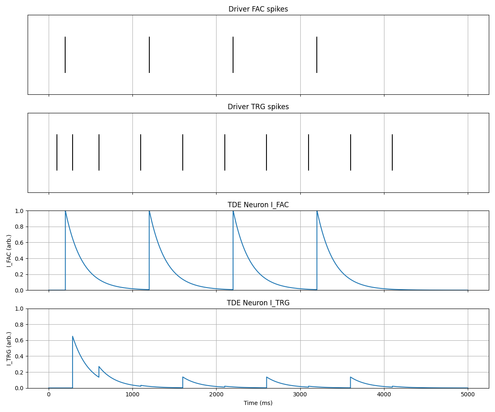
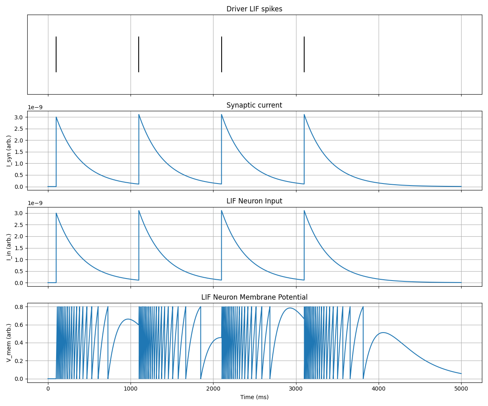

<!-- _class: lead -->

# Monday Meeting
### 13.10.25 Meeting

---

# **Week Summary**

- Prepared for the meeting with Chiara about the PhD plan.

- Read the original paper about Predictive Coding.

- Discussed with Ben about Predictive Coding + insights on how it might work in biology + tactile chip.

- Got real world data from a Postdoc in IIT's lab.

---

# **Started implementation of Elisabetta's sPLL**

- **TDE working :**

--- 

- **LIF TDE working :**

---

# **Next things to do**

- Read about Predictive Coding Light paper (same author as AEC).

- Finish sPLL implementation + Test with noisy input spike trains.

- Take a look into the papers than Ben recommended.
