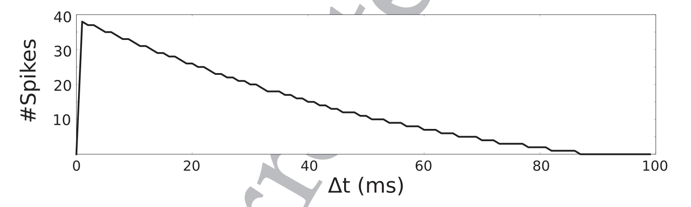
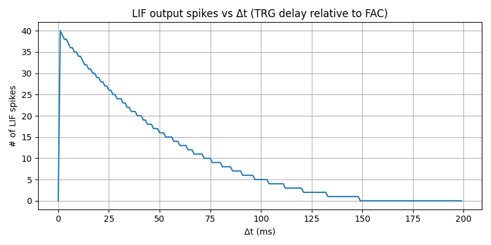
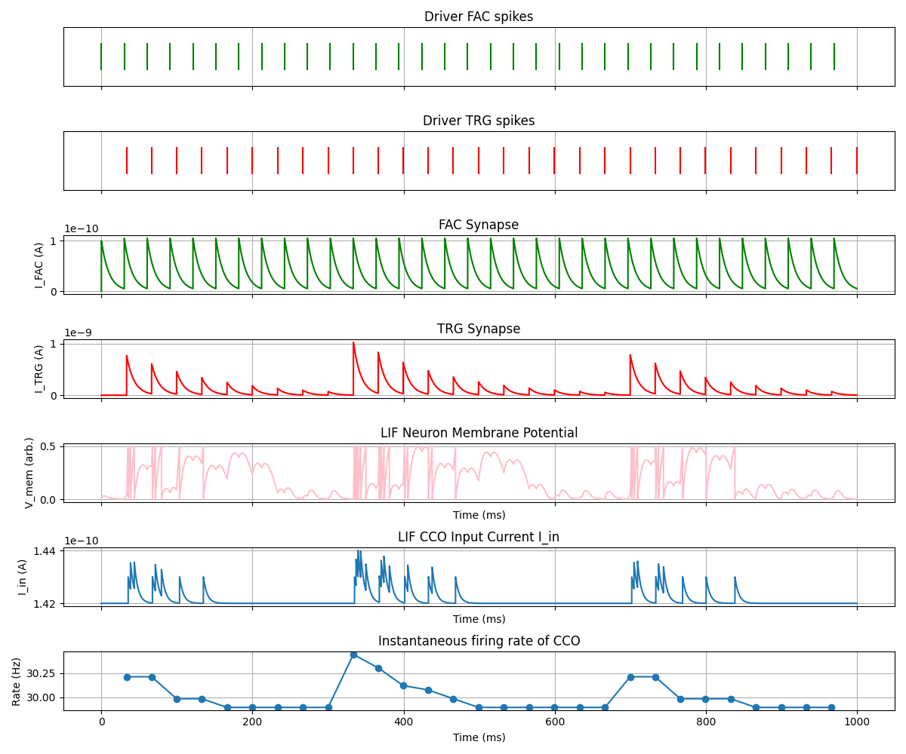
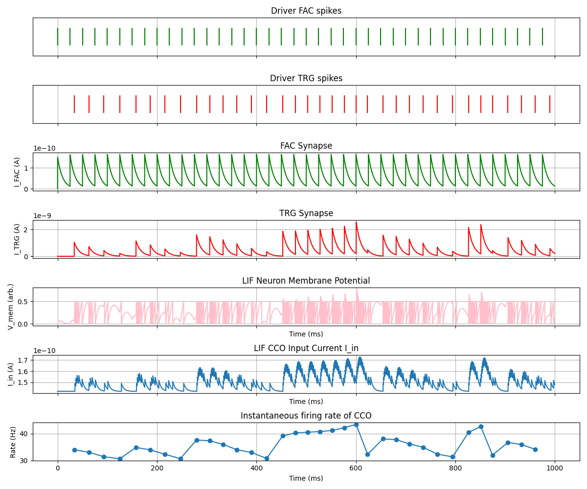
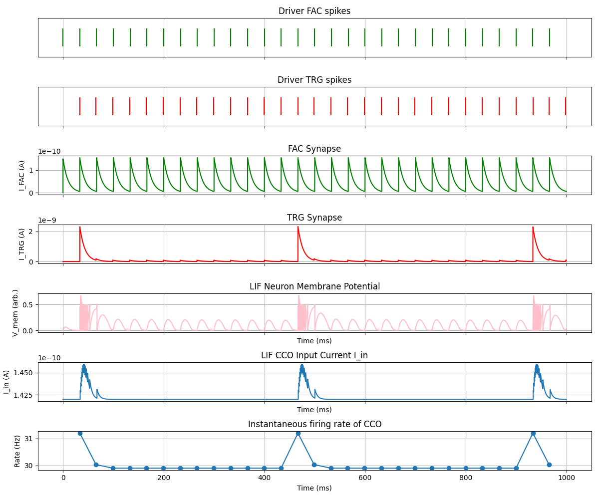

<!-- _class: lead -->

# Monday Meeting
### 20.10.25 Meeting

---

# **Miscellaneous**

Meeting with Chiara and Simeon on Monday.

---

# **Week Summary**

- Implemented sPLL.

- Started reading about Predictive Coding Light.

- Started looking at tactile experiment.

---

# **Implementation of sPLL**

--- 

# **33 Hz input | 30 Hz CCO  :**

---

# **40 Hz input | 30 Hz CCO :**

---

# **30 Hz input | 30 Hz CCO :**

---
# **Next things to do**

- Proceed with tactile experiment.

- Test the sPLL with noise ? 

- Look into Christian toolbox for bursting PLL.

- Finish reading in details Predictive Coding Light paper to implement it.
