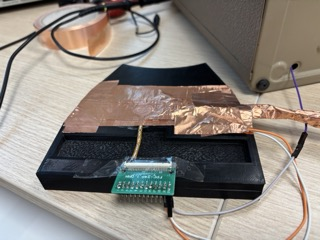
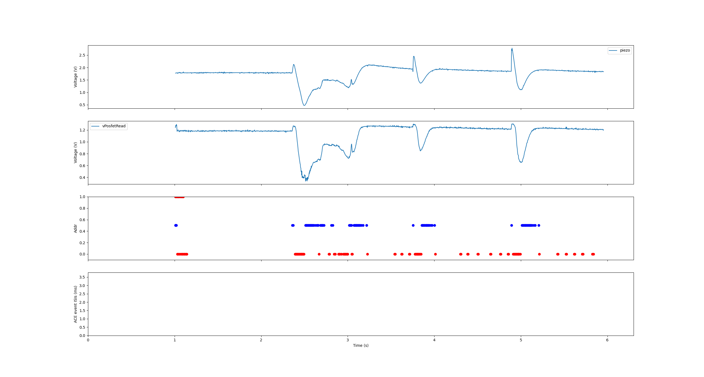
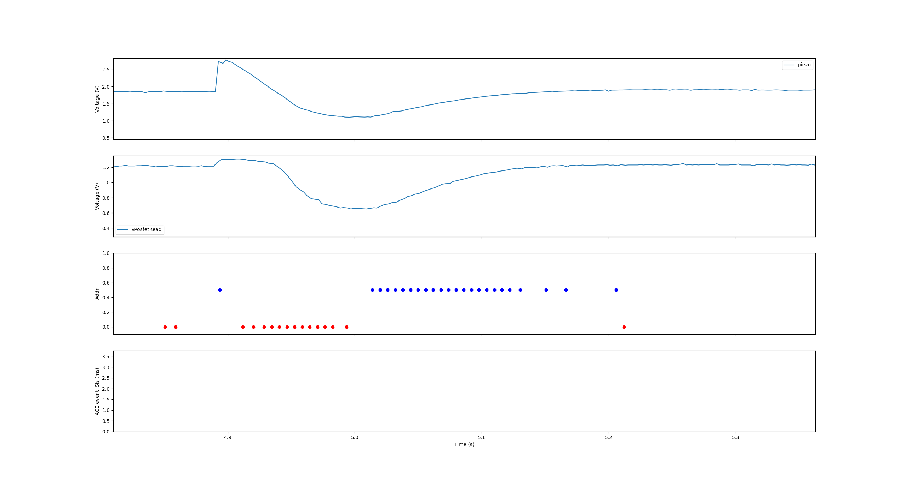
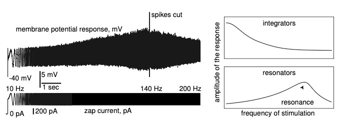
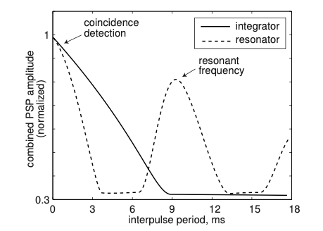
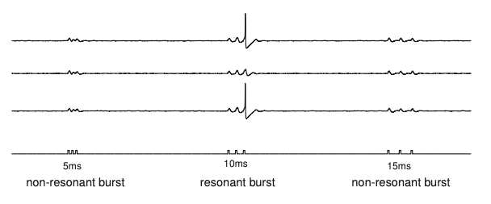
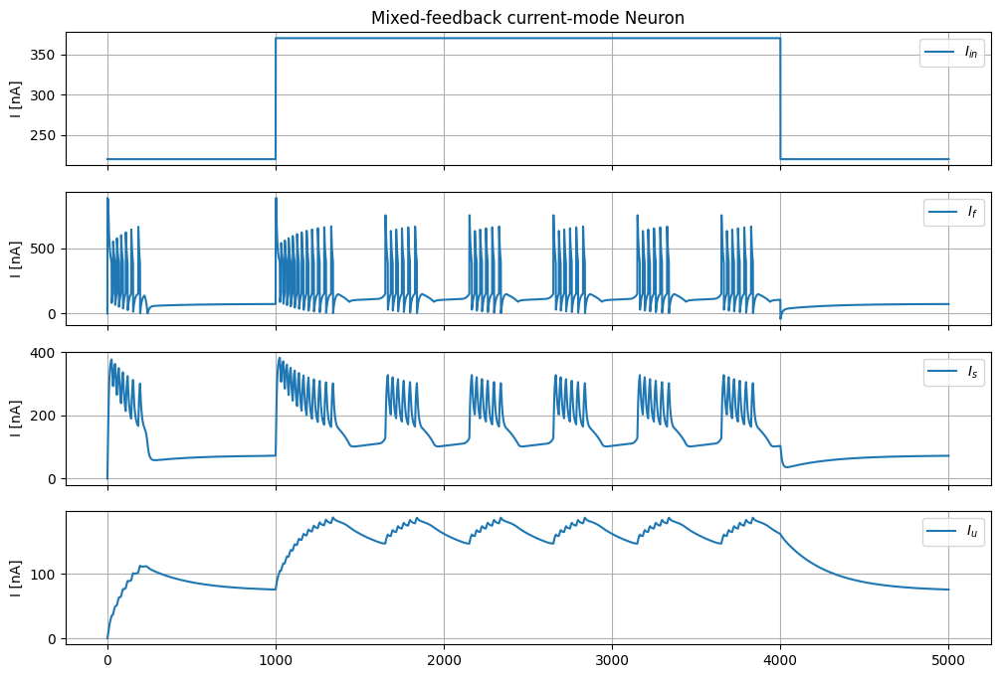

<!-- _class: lead -->

# Monday Meeting
### 24.11.25 Meeting

---

# Progress this past week

- Sensor setup (Piezoelectric + Capacitive):

---

<!-- # Progress this past month

- Chip recording:

 -->

# Progress this past week

- Recordings with old chip:

|  |  |
|---|---|

---

# Progress this past week

- Started reading about type III excitability and resonator neurons.

- Resonator neurons act as band-pass filters for periodic signals.

 

---

# Progress this past week

- Resonator neurons act as coincidence detectors at a preferred frequency of input spike trains.

<!-- 

 -->

|  |  |
|---|---|
---

# Progress this past week

- In a network of resonator neurons, selective communication can be achieved without changing synaptic connections efficacy.

 

---

# Progress this past week

- Started reading Izhikevich "Dynamical Systems" book to understand the theory behind type III excitability. 

---

# Progress this past week

- Implemented Loris' model on Brian2 (with simplified sigmoids).

 

---

# **TO-DO List**

- Try implementing a type III excitability with Loris neuron model.

- Dive into phase plane analysis of resonator neurons.

- Continue with sensor characterization for ATIS paper.

