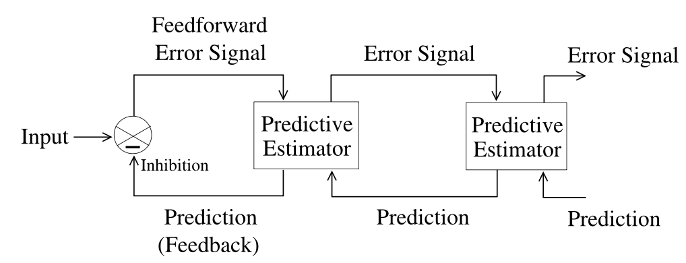
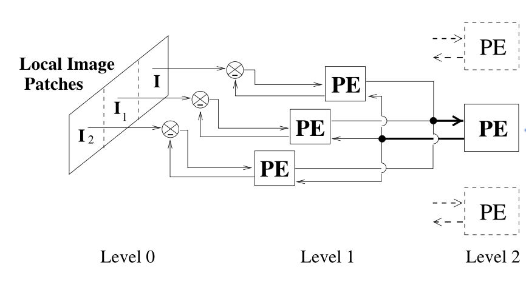

<!-- _class: lead -->

# PhD Structure Plan

---

# **Proposed PhD Title/Direction**

**Toward Efficient Neuromorphic Tactile Processing: From Sensing to Active Efficient Coding**

---

# **Research Goal**

- Biological systems encode sensory input efficiently and sparsely through spikes.

- Neuromorphic systems offer energy-efficient, event-driven computations.

&rarr;  **Implement a tactile pathway for efficient information processing based on Efficient Coding Principles.**

---

# **Focus Areas**

- Neuromorphic encoding of analog tactile signals into spikes.

- Extraction of perceptual features.

- High-level integration of information with control/adaptation mechanisms.

---

# **Overview of Research Stages**

| Stage | Focus | Outcome |
|-----------|-----------|-----------|
| Neuromorphic Tactile Transducer     | Convert tactile analog signals to spikes (bio-inspired sensors)      | Silicon chip + characterization|
| Tactile Processing Primitives     | Extract motion & frequency features      | Modular spike-based computation units |
|Higher-Order Perceptual Features | Texture, Slip, Shape, Contact, etc. | Learn invariant tactile representations
|Efficient Coding Control | Adapt sensory encoding to task & energy efficiency | Active / Predictive coding architecture

---

# **First Stage: Neuromorphic Tactile Transducer**

**Key steps:**

- Implement bio-inspired encoding from capacitive & piezoelectric sensors.

- Characterize fabricated chip (test setup under development).

- Record real tactile data (texture scanning experiments).

---

# **Second Stage: Tactile Processing Primitives**

**Goal:** Design of the foundation of sensory features (motion and frequency).

**Core primitives:**

- ***Motion unit:*** Detects local/global motion motion direction and velocity.

- ***Frequency unit:*** Extracts temporal vibration patterns.

**Outcomes:** Basis set for a hierarchical, efficient tactile processing pathway. 

&rarr; Results in modular processing units producing basis features for integration in higher-level percepts.

--- 

# **Motion units**

- Could be inspired by visual motion detection models (correlation, token-based methods) or dendritic computation.

- Two layers structure:

    - Local motion processing in motion unit receptive field (aggregated taxels).
       
    - Integration of local motions into global motion.
       - End-inhibition from extra-RF for edge detection.

- **Requirements:** Robust to noise and capable of identifying &ne; temporal patterns.

---

# **Frequency units**

**Goal:** Implementation of a neuromorphic PLL to extract input's frequency components.

- Bursting neurons are natural rythmic oscillators.

- Learn parameters to lock into input frequency.
    - Robustness to noise/perturbation.
    - Ideally tunable bandwidth sensitivity.

- Frequency extraction independent from stimulus velocity. 

---

# **Third Stage: Higher-Level Perceptual Features**

**Goal:** Learn invariant tactile representation (for texture, shape, etc.).

- Makes use of combination, correlation or integration of the tactile primitives outputs spatially and temporally to extract more task-relevant features.

- Analog to how early visual features (edges, orientation, motion) lead to perception of shapes.

---

# **Fourth Stage: Efficient Coding Control Layer**

**Goal:** Design a control scheme optimizing both task performance and system energy efficiency.

**Active Efficient Coding:** Adapts biases/gains of lower layers via feedback using a Reinforcement Learning Framework.

**Disadvantages:** Large time invested required and not really neuromorphic with the traditional theory.

---

# **Predictive Coding**

- Uses a hierarchical network minimizing prediction error.

- Feedforward = residual error / Feedback = prediction.

- Only unexpected information is propagated.

  

---

# **Tactile Pathway Overview**

**Hierarchy:**

- **Bottom Layer:** Encode local dynamics (motion, frequency) using tactile primitives.

- **Intermediate Layers:** Learn invariant representations (texture, shape) by integrating local features.

- **Top Layers:** Use Predictive Coding to provide feedback to lower layers to modulate parameters/sensitivity based on task performance and efficiency.

---

# **Tactile Sensory Pathway Information Integration**

  

---

# **Expected Contributions**

- Bio-inspired tactile transducer with RAI / SAII mechanoreceptors.

- Tactile computation primitives for motion/frequency extraction.

- Adaptive control architecture based on Efficient Coding Principles.

- Tentative to model Tactile Sensory Pathway.

---

# **Proposed Timeline**

| Year | Focus | Outcome |
|-----------|-----------|-----------|
|Year 1 | Neuromorphic Tactile Transducer Design/Simulation + Literature Review|Transducer Chip Design + Fab Submission|
|Year 2 | Literature Review + Tactile Processing Primitives + Chip Characterization/Tactile Recordings| Motion + Frequency Neuromorphic Primitives, Tactile Dataset for texture (or other ?)
|Year 3 | Higher-Level Perceptual Features // Predictive Coding Framework | Basic Tactile Tasks implementation (Texture recognition, motion detection)
|Year 4 | Thesis + Remaining Points|
